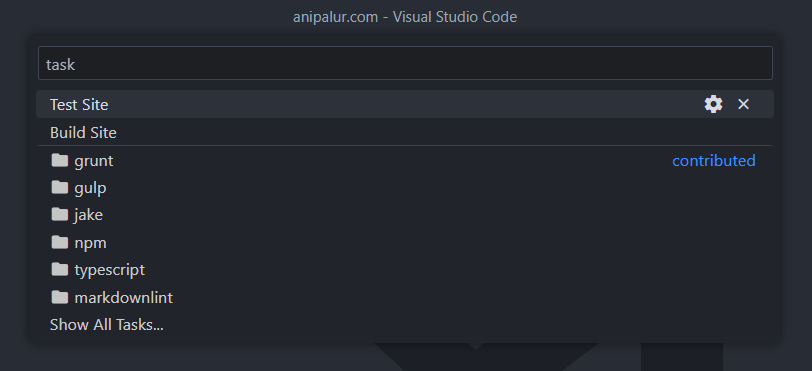
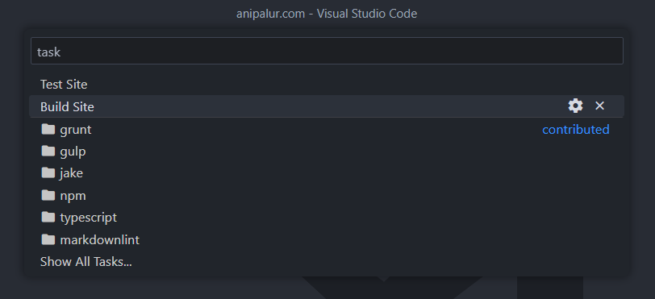

# [anipalur.com][blog-link] <br /> [![hugo-badge]][hugo-link] [![status-badge]][blog-link] [![codefactor-badge]][codefactor-link]

This repository hosts the source code for my personal blog, <https://anipalur.com> -
a fast, secure and flexible static site built with [Hugo][hugo-link]
and hosted by [Cloudflare Pages](https://pages.cloudflare.com "Learn more about Cloudflare Pages.").

## Features

- Support for dark mode
- Fully responsive layout viewable on all devices
- Fully keyboard-accessible
- Uses [Tabler Icons](https://tabler-icons.io "Learn more about Tabler Icons.") for buttons
- Includes native search
- Built with pure JavaScript and CSS
- Support for tags, categories and subsections
- Automatic RSS feed, sitemap and robots.txt generation
- [PhotoSwipe](https://photoswipe.com "Learn more about PhotoSwipe.") support for image galleries and lightboxes
- Automatic table of contents and related posts generation

## Adapting this Project

Feel free to fork this project and customise it for your own use.
See the [Quickstart](#quickstart "View the Quickstart section.") section for steps on getting started.

If you have any questions, see [SUPPORT.md](/.github/SUPPORT.md "View the SUPPORT.md file.")
or [contact me](https://anipalur.com/contact "Learn how to contact me.").

## Quickstart

Follow these steps to get started with running this project locally.

### Prerequisites

- Git:
  - [Git for Windows](https://git-scm.com/download/win "Download Git for Windows.")
  - [Git for macOS](https://git-scm.com/download/mac "Download Git for macOS.")
  - [Git for Linux](https://git-scm.com/download/linux "Download Git for Linux.")
- [Go](https://go.dev/doc/install "Install Go.")
- Hugo (**extended** version[*](#hugo-version)):
  - [Hugo for Windows](https://gohugo.io/installation/windows "Install Hugo for Windows.")
  - [Hugo for macOS](https://gohugo.io/installation/macOS "Install Hugo for macOS.")
  - [Hugo for Linux](https://gohugo.io/installation/linux "Install Hugo for Linux.")
- Node.js (optional[**](#hugo-version)):
  - [Node.js for Windows](https://nodejs.org "Download Node.js for Windows.")
  - [Node.js for macOS](https://nodejs.org "Download Node.js for macOS.")
  - [Node.js for Linux](https://nodejs.org/en/download/package-manager "Download Node.js for Linux.")

<a id="hugo-version">*</a>
See [Stack's theme.toml file](https://github.com/CaiJimmy/hugo-theme-stack/blob/master/theme.toml#L23 "View Stack's theme.toml file.")
for the minimum Hugo version required.

<a id="node-js">**</a>
Node.js comes with npm when downloaded. npm is used for test and build scripts.

### Installation

Follow these steps to install this project locally.

1. Open a CLI (e.g. PowerShell, Terminal, etc.).
2. Navigate to a folder you want to clone this repository into.
3. Clone this repository.

    ```shell
    git clone https://github.com/anipalur/anipalur.com.git
    ```

4. Navigate to the project folder.

    ```shell
    cd anipalur.com
    ```

5. Install all dependencies.

    ```shell
    npm install
    ```

### Development Server

Preview the blog using the following command.

```shell
npm run test
```

Alternatively, if you are using Visual Studio Code, use Quick Open (<kbd>CTRL</kbd> + <kbd>P</kbd>),
type 'task', press space and select `Test Site`.

<div align="center">
  
</div>

This will start Hugo's built-in development server.
Visit the URL shown in the CLI (usually <http://localhost:1313>) to view the blog.  
To stop the development server, use <kbd>CTRL</kbd> + <kbd>C</kbd>.

## Publishing

Publish the blog using the following command.

```shell
npm run build
```

Alternatively, if you are using Visual Studio Code, use Quick Open (<kbd>CTRL</kbd> + <kbd>P</kbd>),
type 'task', press space and select `Build Site`.

<div align="center">
  
</div>

This will publish all static files in the `public` directory.  
These files can then be used in a simple hosting environment.
See [Hugo's documentation on hosting and deployment](https://gohugo.io/hosting-and-deployment "View Hugo's documentation on hosting and deployment.") for more.

## Contributing

Issues and pull requests are welcome! See [CONTRIBUTING.md][contributing-link] to get started.  
Please note that I only accept contributions to source code, not content.

## Attribution

- This blog was built with [Hugo][hugo-link] using the [Stack][stack-link] theme by [Jimmy Cai][jimmy-link].  
  Portions of this theme have been modified to meet my needs.
  These modifications are listed on the [Licence](https://anipalur.com/license/#list-of-modifications "View a list of modifications made to the Stack theme.") page.
- Thanks to [nayafia's CONTRIBUTING.md template](https://github.com/nayafia/contributing-template "View nayafia's contributing guide.")
  for inspiring this project's [CONTRIBUTING.md][contributing-link] file!
- Thanks to [readme.so](https://readme.so "Visit readme.so!") for helping create this README.md file!

## Licenses

### Source Code


**Copyright &copy; 2020-2023 [Jimmy Cai][jimmy-link]**  
**Copyright &copy; 2023 Anitej Palur**  
The source code for this blog is licensed under a [GNU GPLv3](https://www.gnu.org/licenses/gpl-3.0.html "Learn more about the GNU GPLv3 License.") License.

See [LICENSE-CODE](/LICENSE-CODE "View the LICENSE-CODE file.")
and the [Licence](https://anipalur.com/license "View the Licence page.") page for more information.

### Content


**Copyright &copy; 2023 Anitej Palur**  
Except otherwise noted, all content (both text and images) on this blog is licensed under a
[Creative Commons Attribution-ShareAlike 4.0 International (CC BY-SA 4.0)](https://creativecommons.org/licenses/by-sa/4.0 "Learn more about the CC BY-SA 4.0 Licence.") Licence.

See [LICENSE-CONTENT](/LICENSE-CONTENT "View the LICENSE-CONTENT file.")
and the [Copyright](https://anipalur.com/copyright "View the Copyright page.") page for more information.

[blog-link]: https://anipalur.com "Visit my personal blog."
[stack-link]: https://github.com/CaiJimmy/hugo-theme-stack "Learn more about the Stack theme."
[jimmy-link]: https://jimmycai.com "Learn more about Jimmy Cai."
[contributing-link]: /CONTRIBUTING.md "View the CONTRIBUTING.md file."

[hugo-badge]: https://img.shields.io/badge/dynamic/toml?url=https%3A%2F%2Fraw.githubusercontent.com%2FCaiJimmy%2Fhugo-theme-stack%2Fmaster%2Ftheme.toml&query=%24.min_version&prefix=v&style=flat&logo=hugo&logoColor=FF4088&label=Hugo&color=FF4088
[hugo-link]: https://gohugo.io "Learn more about Hugo."

[codefactor-badge]: https://img.shields.io/codefactor/grade/github/anipalur/anipalur.com?style=flat&logo=codefactor&logoColor=F44A6A&label=Code%20Quality
[codefactor-link]: https://www.codefactor.io/repository/github/anipalur/anipalur.com "View this project's code quality grade."

[status-badge]: https://img.shields.io/website?up_message=Online&up_color=1F883D&down_message=Offline&down_color=DA3633&url=https%3A%2F%2Fanipalur.com&style=flat&label=Status
