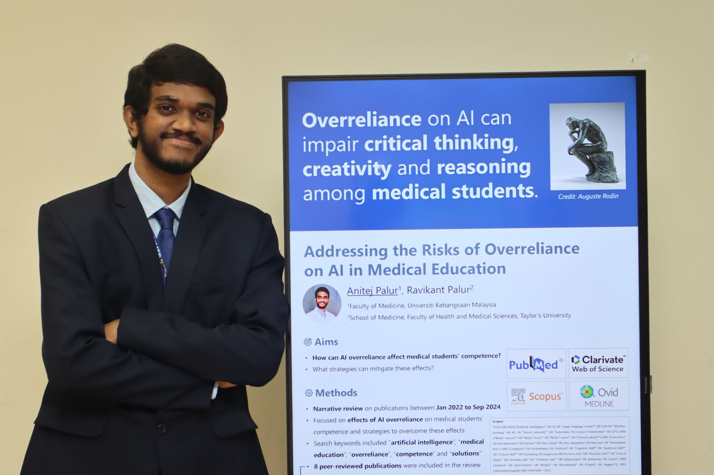
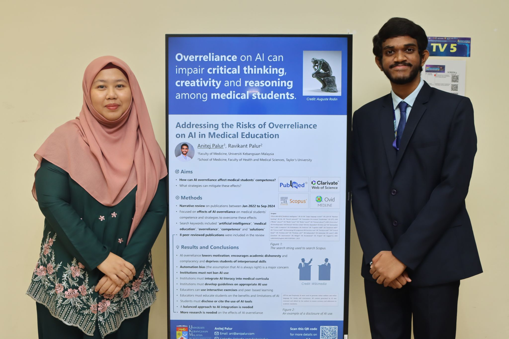
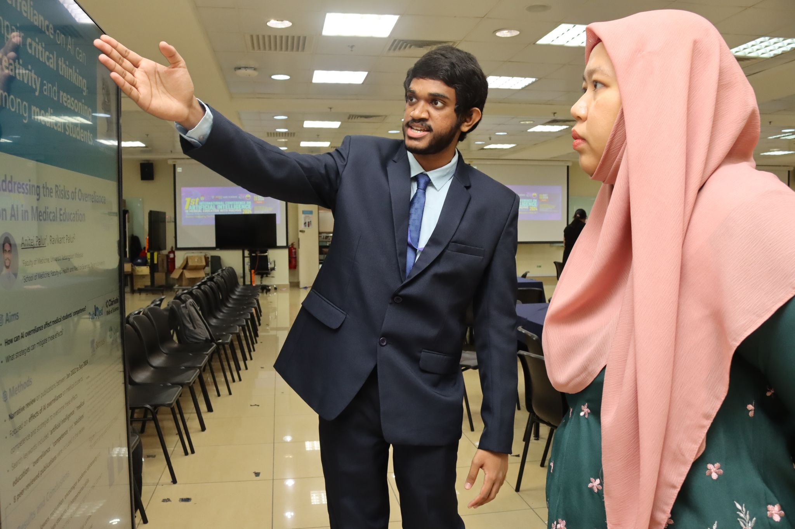
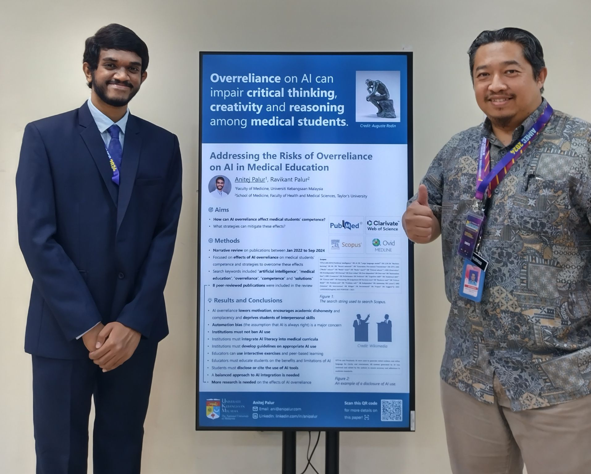
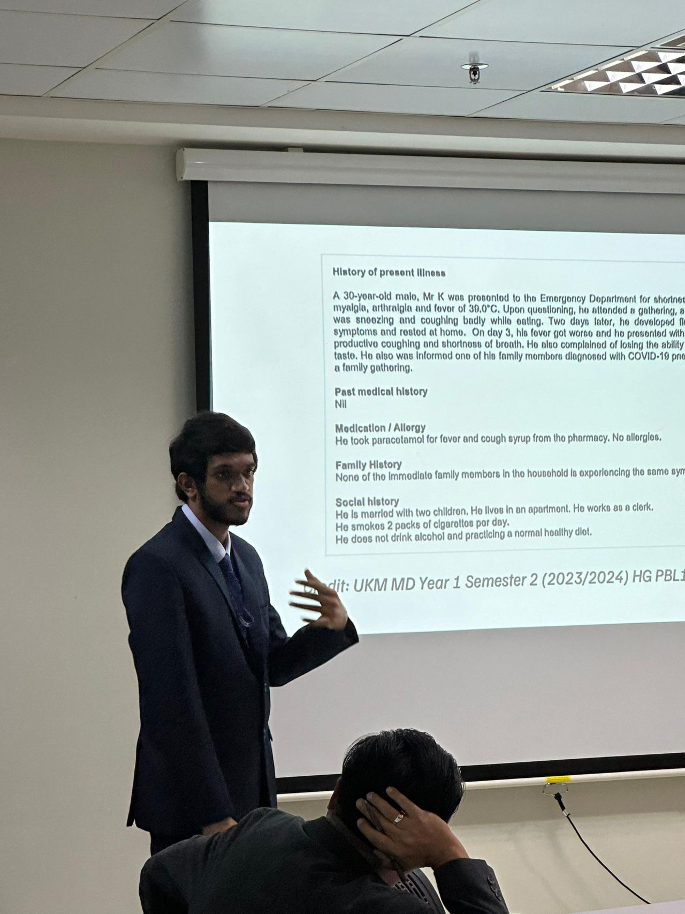
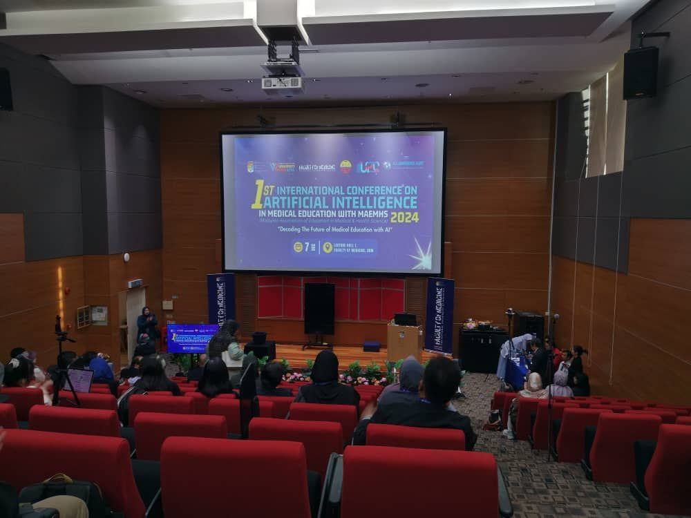

Last month, I had the incredible opportunity to attend the
[1st Artificial Intelligence in Medical Education Conference (AIMEC) 2024](https://www.ukm.my/aimec "Learn more about AIMEC 2024."),
where I presented a poster on my research titled "Addressing the Risks of Over-Reliance on AI in Medical Education".

I am pleased to share that my conference abstract has been published in [Medicine and Health](https://medicineandhealthukm.com "Learn more about Medicine and Health."),
marking an important milestone in my research journey.

It was also a wonderful experience participating in the Student Pitching Competition, where I had the chance to refine my pitching skills and receive valuable feedback from experts in AI and medical education.

Thank you to the [Faculty of Medicine, UKM](https://www.ukm.my/medicine/language/en/home-faculty-of-medicine-ukm "Learn more about the Faculty of Medicine, UKM."),
the [Malaysian Association of Education in Medical and Health Sciences (MAEMHS)](https://maemhs.wordpress.com "Learn more about MAEMHS."),
speakers and attendees for making AIMEC 2024 a success.
I look forward to applying what I have learned and continuing these important conversations!

<i class="fa-solid fa-file" aria-hidden="true"></i>
*Read my abstract:*  
<https://doi.org/10.17576/MH.2024.s1909#page=33>

<!--sse-->
<i class="fa-solid fa-video" aria-hidden="true"></i>
*Watch a video of my poster presentation:*  
<https://youtu.be/VVqEUCaNxk0>

<i class="fa-solid fa-image" aria-hidden="true"></i>
*Pictures from AIMEC 2024:*
<figure>
  
  <figcaption>Anitej standing next to his poster.</figcaption>
</figure>
 
<figure>
  
  <figcaption>Anitej and Associate Professor Dr Akmal, chairperson of AIMEC 2024.</figcaption>
</figure>
 
<figure>
  
  <figcaption>Anitej presenting to the chairperson of AIMEC 2024.</figcaption>
</figure>
 
<figure>
  
  <figcaption>Anitej and Associate Professor Dr Nurman, judge of poster presentations.</figcaption>
</figure>
 
<figure>
  
  <figcaption>Anitej presenting during the Student Pitching Competition.</figcaption>
</figure>
 
<figure>
  
  <figcaption>The AIMEC 2024 lecture hall.</figcaption>
</figure>
<!--/sse-->
