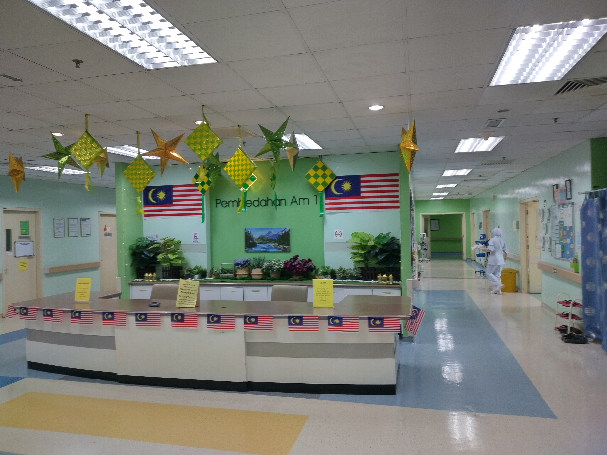

Last week, I concluded my three-week General Surgery elective at
[Hospital Sungai Buloh (HSB)](https://en.wikipedia.org/wiki/Sungai_Buloh_Hospital "Learn more about Hospital Sungai Bulh."),
where I had the opportunity to join third-year medical students from
[Taylor's University](https://university.taylors.edu.my/en/study/explore-all-programmes/medicine.html "Learn more about Taylor's University School of Medicine.")
during their General Surgery posting.
It was an incredible opportunity to immerse myself in the surgical field and learn directly from surgeons, clinicians and patients.

During my elective, I was able to:

- Clerk patients in the ward and clinic with a wide range of conditions, including acute appendicitis, inguinal hernia, cholelithiasis, perforated PUD,
  multinodular goitre, papillary carcinoma, lipoma, carbuncle, anal fistula and more
- Prepare and present case reports
- Observe daycare procedures such as OGDS, colonoscopy, FNAC and proctoscopy
- Observe surgical procedures including total thyroidectomy and lipoma excision
- Actively participate in bedside teaching, case-based learning sessions, seminars and lectures
- Learn first-hand about the diagnosis and management of surgical patients, from initial presentation to post-operative care

This experience not only deepened my understanding of surgical diseases but also gave me valuable insights into the importance of teamwork,
precision and patient-centred care in surgery.

I am truly grateful to the HSB staff and Taylor's University faculty for their teaching, guidance and support throughout my elective.

I look forward to applying what I have learnt as I continue my journey to becoming a neurosurgeon.

<i class="fa-solid fa-image" aria-hidden="true"></i>
*Pictures from my elective:*
<figure>
  
  <figcaption>Anitej standing outside HSB.</figcaption>
</figure>
 
<figure>
  
  <figcaption>The entrance to HSB. The ORs were one level above the entrance.</figcaption>
</figure>
 
<figure>
  
  <figcaption>The view from inside HSB. Love the trees!</figcaption>
</figure>
 
<figure>
  
  <figcaption>The General Surgery ward at HSB.</figcaption>
</figure>
 
<figure>
  
  <figcaption>Anitej standing in the General Surgery ward. Look at all those flowers!</figcaption>
</figure>
 
<figure>
  
  <figcaption>Another view of the General Surgery ward at HSB.</figcaption>
</figure>
 
<figure>
  
  <figcaption>Anitej standing outside the General Surgery clinic.</figcaption>
</figure>
 
<figure>
  
  <figcaption>Anitej standing outside the Endoscopy Unit.</figcaption>
</figure>
 
<figure>
  
  <figcaption>The Endoscopy Unit at HSB. The staff here were very friendly.</figcaption>
</figure>
 
<figure>
  
  <figcaption>Anitej waiting outside the OR.</figcaption>
</figure>
 
<figure>
  
  <figcaption>Brought a cake for my friends on the last day of my elective. It was quite tasty!</figcaption>
</figure>
<!--/sse-->
