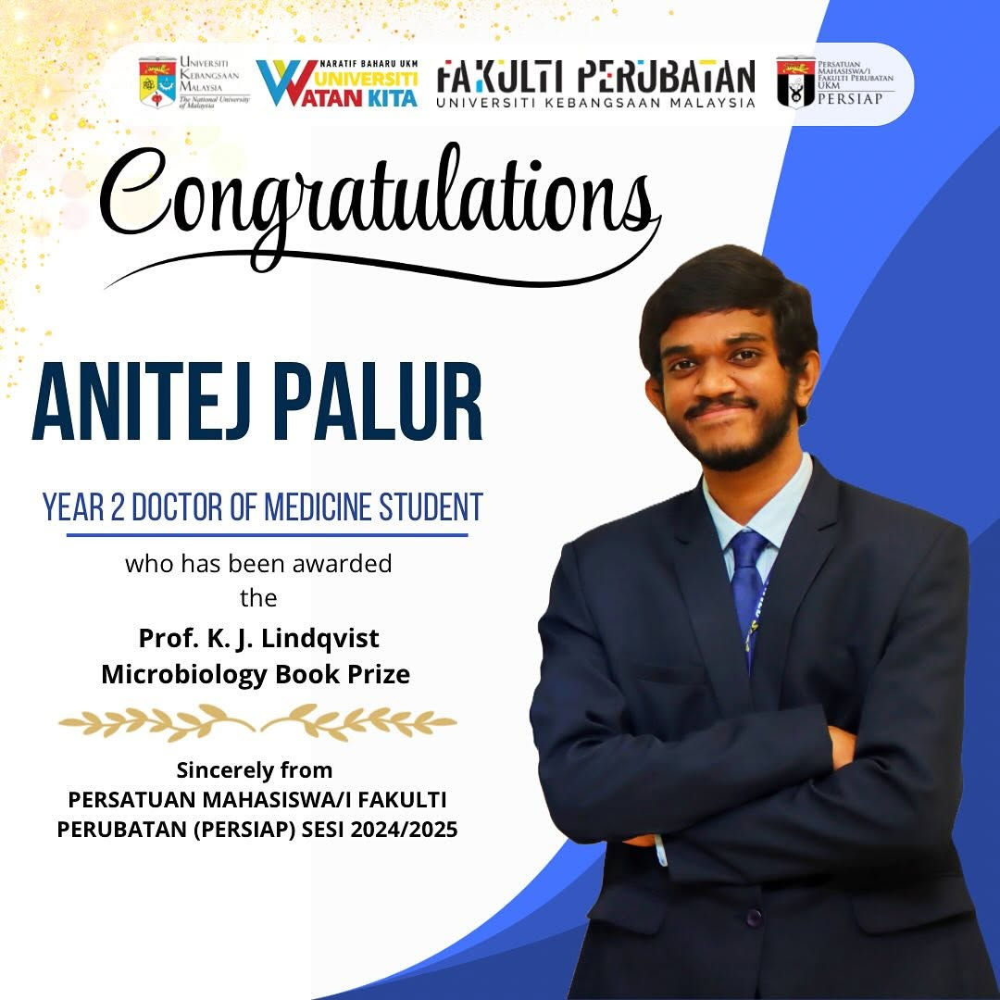

I am deeply honoured and humbled to be the recipient of the prestigious Prof. K. J. Lindqvist Microbiology Book Prize.
This prize is awarded annually to the best-performing medical student in the Infection and Immunity module during the first year of the Doctor of Medicine programme.
This prize is awarded by the Department of Medical Microbiology and Immunology and includes a cash prize of RM 1,000.

Thank you to all lecturers and faculty members for your support and guidance! I hope to continue making you proud in my future endeavours.

 

<!--sse-->
<figure>
  
  <figcaption>
    Photo Credit:
    <a href="https://www.instagram.com/persiapukm/p/DINyACSSVaA" width="50%" title="Learn more about the Student Union of the Faculty of Medicine, UKM." target="_blank" rel="noopener" class="external-link">Student Union of the Faculty of Medicine, UKM</a></figcaption>
  </figure>
<!--/sse-->
