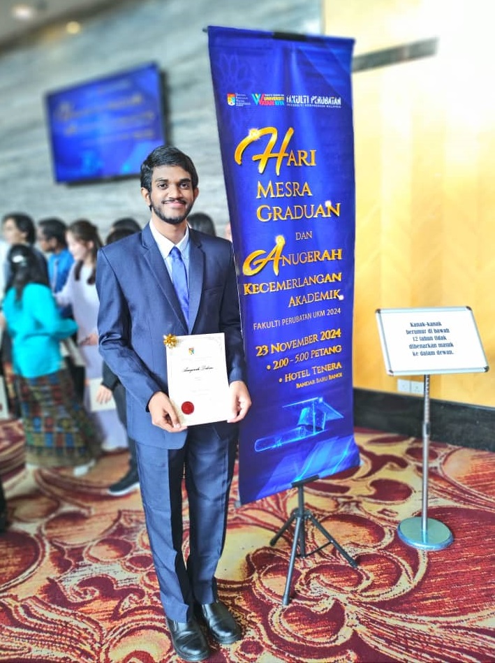

  

    

      It was an honour to receive the Dean's Award for academic excellence for both semesters 1 and 2 of my first year at the Dean's Award Ceremony 2024.
      The Dean's Award acknowledges students who demonstrate academic success during their studies at the
      <a href="https://www.ukm.my/medicine/language/en/home-faculty-of-medicine-ukm" alt="Learn more about the Faculty of Medicine, UKM." target="_blank" rel="noopener" class="external-link">Faculty of Medicine, UKM</a>.
    

    

      The ceremony was not just a celebration of our achievements but also of the graduating students of 2024.
      It was humbling to be among so many accomplished individuals.
    

    

      Thank you to all lecturers and faculty members for your support and guidance! I hope to continue making you proud in my future endeavours.
    

  

  

    <!--sse-->
    
    <!--/sse-->
  

